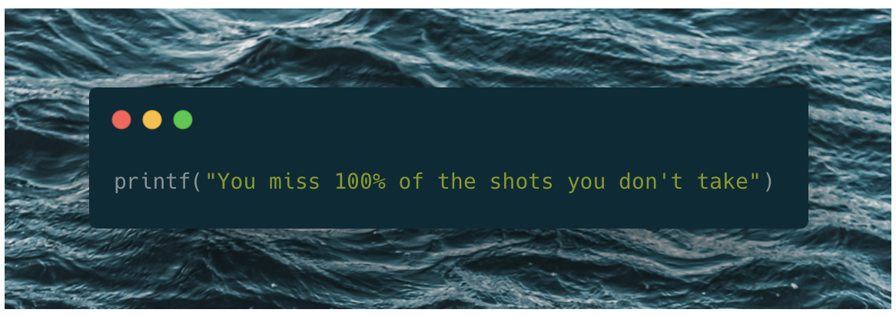

# Hey, I'm Ariv 👋

📍 **San Francisco, CA** | 💻 **Software Engineer** | 🧠 **Building with AI** | ☕ **Powered by caffeine & curiosity**

> I build production systems that scale and ship tools that solve real problems. Currently deep in the LLM infrastructure space, figuring out how to make AI cheaper and more observable for everyone.

## What I'm Working On

- 🔬 **Building in public** — shipping open-source developer tools at the intersection of SWE and AI
- 🏗️ **Production systems** — telemetry at 50M+ data points/day, payment pipelines processing $90K+, APIs at 12K+ queries/month
- 🤝 **Open source** — contributing to LLM infrastructure and developer tooling ecosystems
- 📝 **Writing** — sharing what I learn about building, scaling, and breaking things

## Background

MS in Business Analytics from Northeastern. Previously built production systems at **Hyundai Motors** (vehicle telemetry at scale), **Serotonin** (Web3 Startup), **Crossroads** (serverless data pipelines on AWS) and BrightMinds Organization (current). AWS Certified Solutions Architect.

I think the best engineers understand both the code and the business problem. I bring both.

## Off the Clock

Captain energy on the football pitch ⚽ (yes, football, I'll die on that hill), gym regular, and always down for a debate about Premier League tactics or the superior form of caffeine.

  

## Let's Connect

