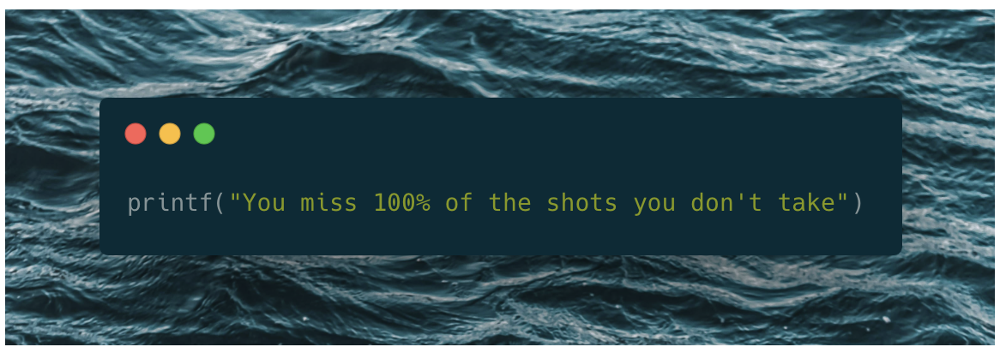

# Hey, I'm Ariv 👋

📍 **Alabama, US** | 🧠 **AI engineering · product · software** | 🛠️ **Building something every day** | ☕ **Powered by caffeine & curiosity**

> I'm into AI engineering, product management and software engineering, and I build AI stuff every day: agents, voice agents and developer tools. My favorite problems cross boundaries: understand the tech, talk to the people, figure out what matters, ship it.

## What I'm Working On

- 🗣️ **[Ariv's AI](https://arivsai.app)**: a voice agent that talks to people about me, books time on my calendar, and says it's an AI. ([code](https://github.com/ArivunidhiA/PersonalOperator))
- 💸 **[forecost](https://github.com/ArivunidhiA/forecost)**: a local, content-free flight recorder for AI coding agents. It logs what they spend, reconciles meters that disagree, and enforces budgets.
- 🎨 **Registrum**: tells you when what shipped stopped matching the design someone signed off in Figma. Pre-release.
- 🌏 **Malbit**: real-time Korean ↔ English voice translation for meetings, running entirely on the laptop.
- 🤝 **Open source**: merged fixes in [Agno](https://github.com/agno-agi/agno), [NVIDIA NeMo Curator](https://github.com/NVIDIA/NeMo-Curator), [PyTorch AO](https://github.com/pytorch/ao) and PaperBanana.

## Background

- **Now:** Client Project Coordinator at INZI Controls, an automotive parts supplier. The work is basically forward-deployed: I'm the bridge between INZI and the other companies on a project, and I pick up engineering problems along the way.
- **Before:** product intern at Serotonin (Web3, 2024), intern at Hyundai Motor India (2023), volunteer developer for Crossroads of Michigan and Bright Mind Enrichment.
- **School:** MS in Business Analytics, Northeastern. B.Tech in Computer Science, SRM.

I think the best engineers understand both the code and the business problem. I'm early in my career, and I'm working on both.

## Off the Clock

Football ⚽ (yes, football, I'll die on that hill), the gym, woodworking, art, and guitar (I'm learning). Always down for a debate about Premier League tactics or the superior form of caffeine.

  

## Let's Connect

